Nama    : Maysarah  
NIM     : 2110131120006

# 
 Review Aplikasi Duolingo sebagai _Tutor_, _Tools_, dan _Tutee_ dalam Pengajaran dengan Komputer

 Aplikasi Duolingo adalah platform pembelajaran bahasa yang dirancang agar terasa seperti permainan. Aplikasi ini dikembangkan oleh Luis von Ahn dan Severin Hacker pada tahun 2011. Duolingo memiliki fitur belajar keterampilan Bahasa Inggris yang lengkap yang meliputi keterampilan menyimak, berbicara, membaca, dan menulis. Duolingo tersedia dalam aplikasi mobile maupun web.

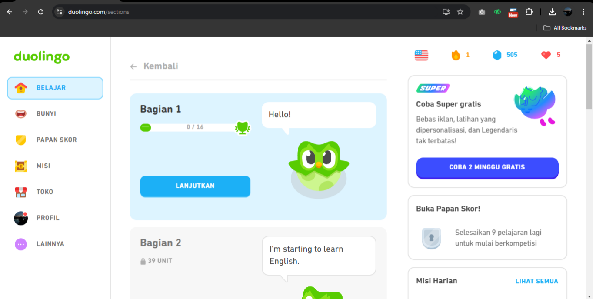

## As Tutor

 Sebagai <b>Tutor</b>, Duolingo efektif dalam menyediakan pengenalan dasar bahasa dengan cara yang menyenangkan dan interaktif. Duolingo menyesuaikan level dan materi sesuai dengan kemampuan pengguna. Dengan algoritma berbasis AI, aplikasi ini memberikan tantangan yang sesuai dengan tingkat kemahiran pengguna, sehingga mereka tidak merasa kewalahan atau bosan.
Gambar di bawah adalah contoh bagaimana Duolingo menyediakan materi pembelajaran bahasa dengan metode tutorial, dimana pembelajaran dimulai dari yang paling dasar kemudian berlanjut ke tahap-tahap yang lebih tinggi.

 Berikut tampilan halaman untuk Bagian 1 yang di dalamnya terbagi lagi menjadi banyak sub bagian. Dalam setiap bagian pembelajaran, disediakan buku panduan berupa contoh kata atau kalimat yang akan dipelajari dalam bagian tersebut.

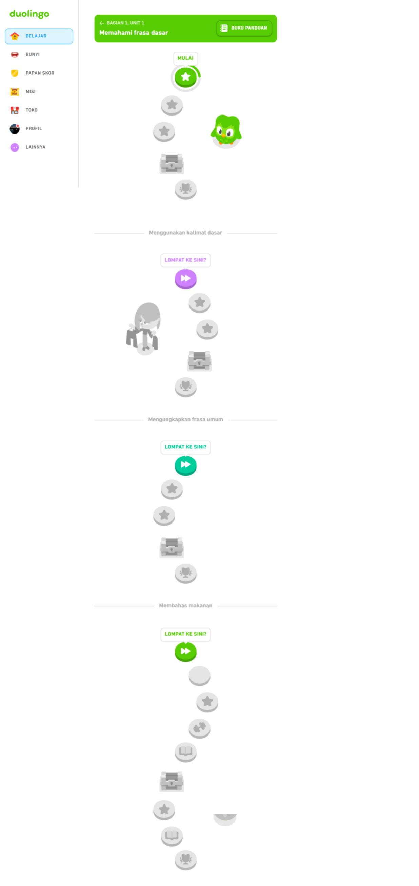
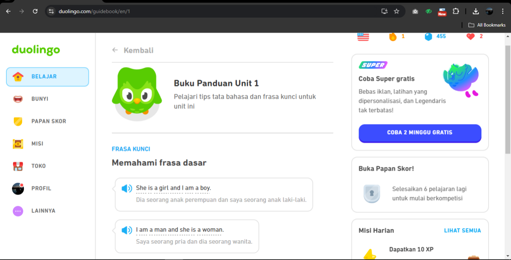

 Ketika memulai pembelajaran, akan disediakan soal-soal dari yang paling dasar hingga soal yang lebih kompleks sesuai dengan levelnya.

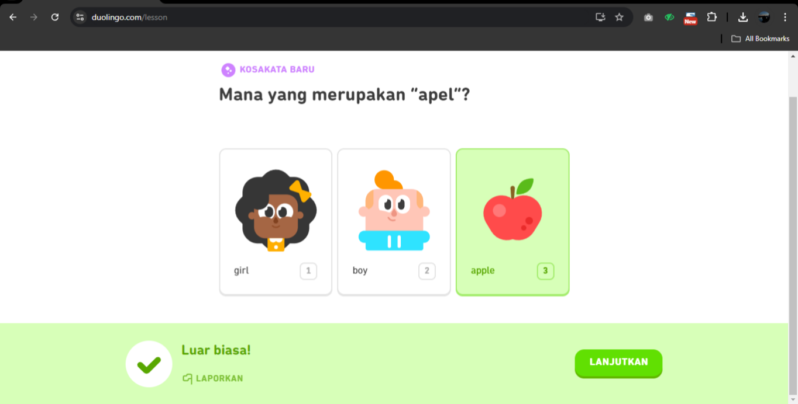

 Seperti gambar diatas, pembelajaran dimulai dengan menampilkan beberapa gambar atau visual, kemudian siswa diminta memilih gambar mana yang cocok dengan kata yang diminta.

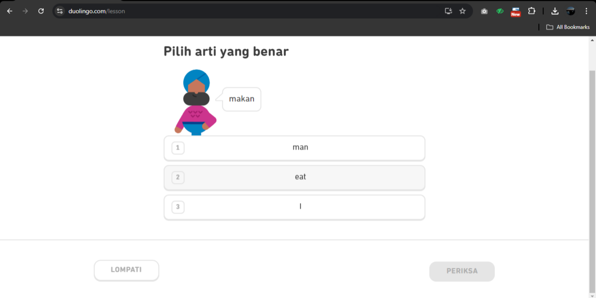

 Selanjutnya, diberikan kata "makan", kemudian siswa diminta untuk memilih kata mana dalam bahasa Inggris yang berarti "makan".

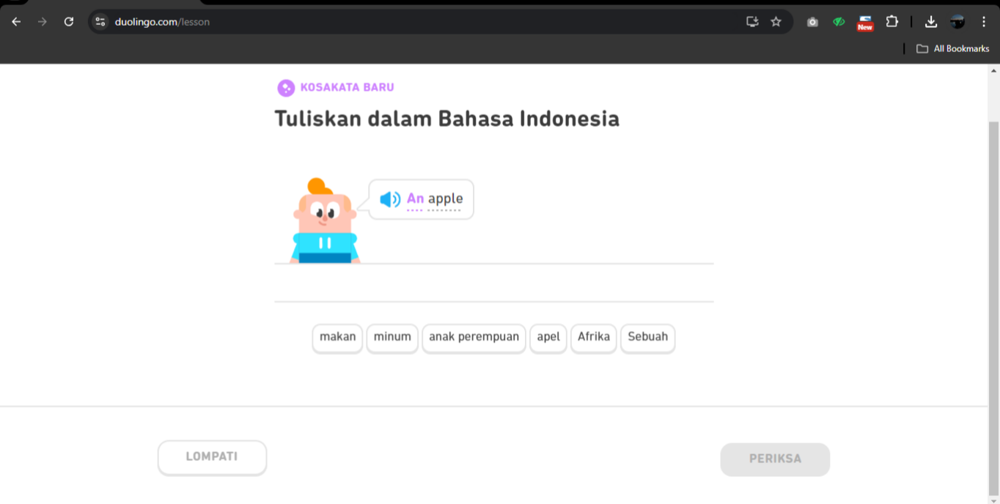

 Setelah mencocokkan kata "apel" dengan gambar apel, siswa diminta menuliskan "an apple" ke dalam bahasa Indonesia.

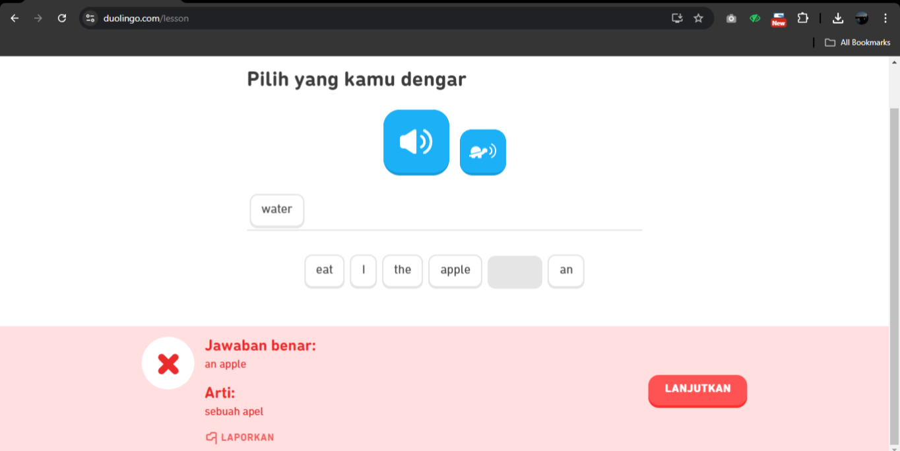

Aplikasi juga dibuat untuk bisa mengoreksi jawaban siswa.

Di akhir sesi pembelajaran, ditampilkan EXP yang diperoleh dan persentase dari kinerja siswa dalam mengerjakan soal-soal. Selain itu, siswa juga dapat melihat kembali ulasan soal dan jawaban yang sudah dikerjakan sebelumnya.

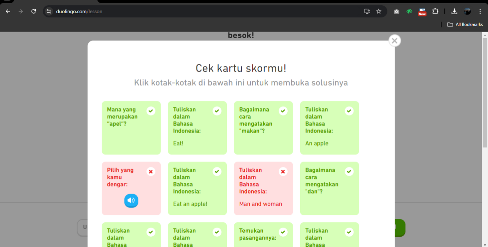

## As Tools

 Sebagai <b>Tools</b>, Duolingo adalah platform pembelajaran bahasa yang mendukung pembelajaran mandiri dan terstruktur. Berikut beberapa aspek utama dari Duolingo sebagai alat bantu pengajaran:

1. 
 Aksesibilitas yang tersedia secara gratis dan dapat diakses di berbagai perangkat, baik melalui aplikasi mobile maupun situs web, membuat mudah dijangkau dan digunakan oleh siswa.

2. 
 Penggunaan game dalam aplikasi berupa elemen gamifikasi, seperti poin, level, dan tantangan harian yang bisa meningkatkan motivasi siswa untuk belajar secara konsisten.

3. 
 Siswa belajar melalui latihan interaktif, termasuk mendengarkan, membaca, menulis, dan berbicara, yang dapat mendukung berbagai gaya belajar.

 Berikut contoh fitur yang dapat digunakan dalam Duolingo untuk melatih pendengaran dan pelafalan bahasa Inggris.

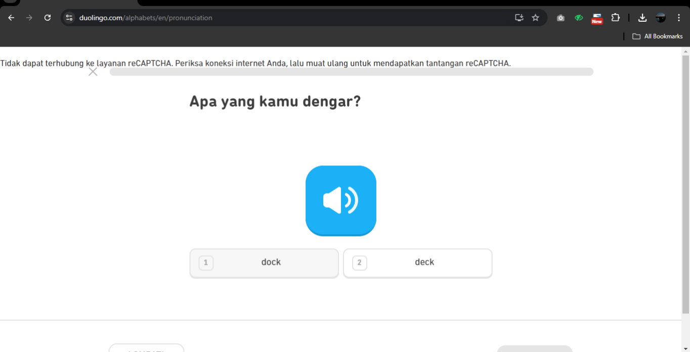

Pada gambar diatas, siswa diminta mendengarkan terlebih dahulu kata yang diucapkan oleh sistem, kemudian memilih kata mana yang cocok dengan yang diucapkan tadi.

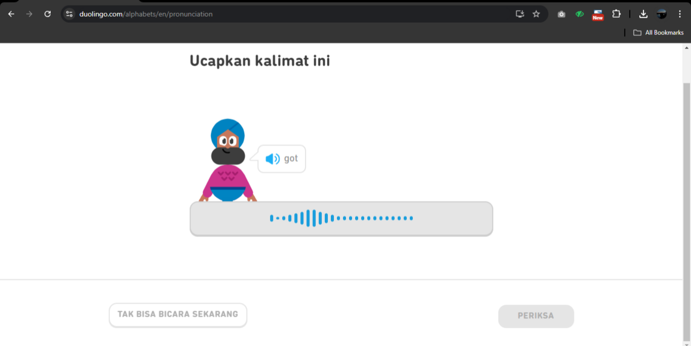

Untuk gambar diatas, siswa diminta untuk mengulangi pengucapan yang dilakukan oleh sistem sebelumnya.

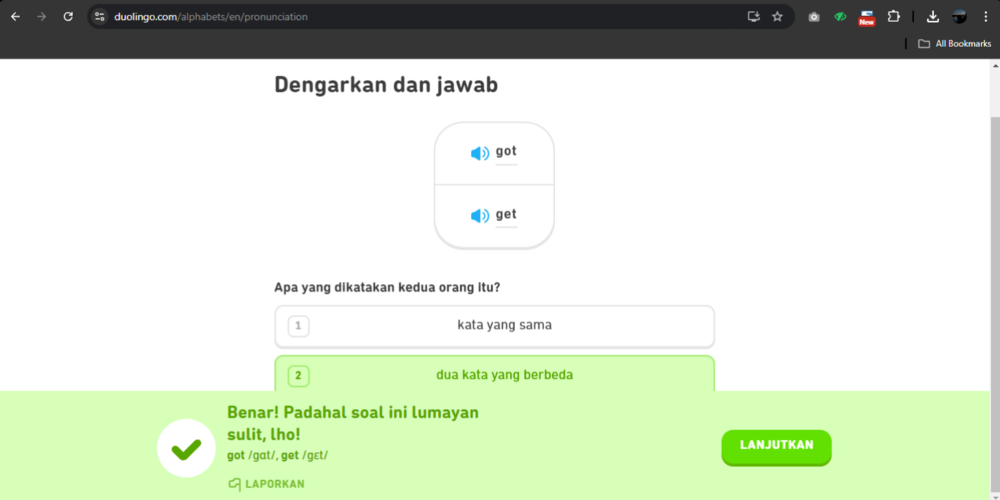

Gambar diatas menunjukkan bagaimana siswa diminta untuk mendengarkan terlebih dahulu 2 kata yang diucapkan, kemudian memilih apakah dua kata tersebut sama atau berbeda.

## As Tutee

Duolingo lebih berfungsi sebagai tutor otomatis atau sistem berbasis AI yang menyajikan materi kepada peserta didik berdasarkan input yang diterima (seperti jawaban benar atau salah) dan memberikan umpan balik yang sesuai. Model ini meniru fungsi seorang guru, tetapi dalam bentuk algoritmik, di mana platform menyesuaikan pelajaran berdasarkan performa pengguna.

